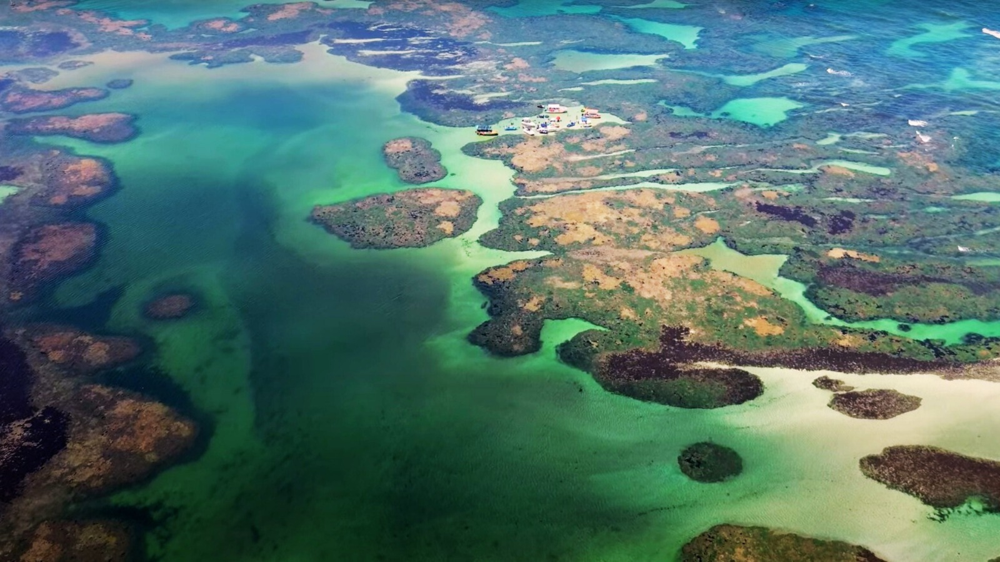

# 👨‍💻 Farol Pitimbu

O **Farol Pitimbu** é um site local que serve como ponto de partida para moradores e visitantes descobirem tudo o que a cidade Pitimbu (PB) tem a oferecer: negócios, profissionais autônomos, prestadores de serviço, eventos, além de informa
cões úteis como tábua de marés e contatos importantes.

## 📸 Demonstração 

## 🛠 Funcionalidades 

- 📁 Listagem de empresas por categoria (Negócios, Profissionais, Serviços)
- 🔍 Sistema de busca por categoria
- 🖼️ Imagens ilustrativas da cidade e serviços locais
- 🏖️ Link para Tábua de Marés
- 📱 Layout responsivo para dispositivos móveis
- 📞 Seção de contatos com números importantes

## 📦 Tecnologias utilizadas

- **HTML5**
- **CSS3**
- **JavaScript**

## 💻 Como usar o projeto

Você pode visualizar o site diretamente do navegador:

**Link**: https://farolpitimbu.com.br/

###📁 Estrutura de diretórios

FarolPitimbu/
├── assets/              # Imagens do projeto
├── paginas/             # Páginas internas: sobre, negócios, contato etc.
├── styles/              # CSS principal e reset
├── index.html           # Página inicial
└── ...                  # Outros arquivos e dependências

####📌 Status do projeto

🚧 Projeto em desenvolvimento – versão 2.1

#####🙋‍♂️ Autor

Carlos Eduardo Marques Veloso
[LinkedIn](https://www.linkedin.com/in/carlos-eduardo-a5294a19b/)
[Portfólio](https://caeddevs.com/)
[carloseduardomveloso@gmail.com](mailto:carloseduardomveloso@gmail.com)

